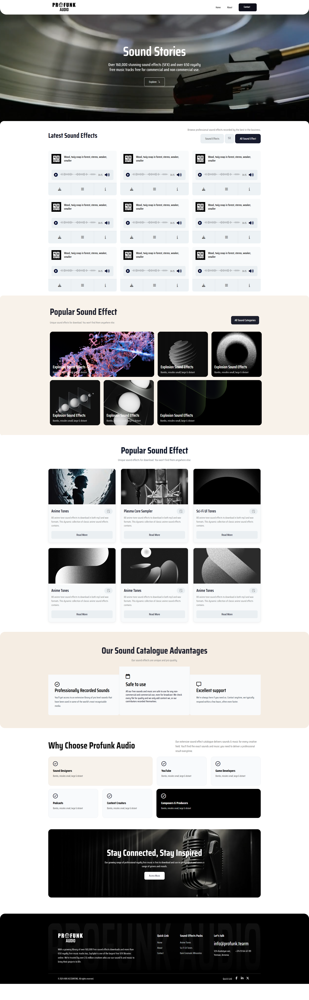

# 🎵 Profunk Audio - Professional Sound Effects Library

A modern, responsive web application for browsing and accessing professional sound effects and royalty-free music. Built with HTML5, CSS3, and JavaScript.

## 🌟 Features

- **Extensive Sound Library**: Access to 160,000+ professional sound effects
- **Royalty-Free Music**: 650+ music tracks for commercial and non-commercial use
- **Interactive Audio Player**: Built-in audio controls with play, pause, and volume
- **Responsive Design**: Optimized for desktop, tablet, and mobile devices
- **Professional Categories**: Organized sound effects by categories (Anime, Sci-Fi, Explosions, etc.)
- **Modern UI/UX**: Clean, intuitive interface with smooth animations

## 🚀 Live Demo

[View Live Demo](https://profunk-audio-six.vercel.app/)

## 📸 Screenshots



## 🛠️ Technologies Used

- **Frontend**: HTML5, CSS3, JavaScript (ES6+)
- **Icons**: Font Awesome 6.5.0
- **Design**: Responsive CSS Grid & Flexbox
- **Audio**: HTML5 Audio API

## 📁 Project Structure

```
profunk-audio-project/
├── assets/
│   ├── css/
│   │   ├── style.css              # Main stylesheet
│   │   ├── banner.css             # Hero section styles
│   │   ├── latestSound.css        # Latest sounds section
│   │   ├── popularSound.css       # Popular sounds grid
│   │   ├── popularCard.css        # Sound cards styling
│   │   ├── catalogueAdvantages.css # Advantages section
│   │   ├── chooseProfunk.css      # Why choose section
│   │   ├── accessMusic.css        # Music access section
│   │   └── footer.css             # Footer styling
│   ├── images/
│   │   ├── heroSectionImg/        # Hero section images
│   │   ├── logo/                  # Brand logos
│   │   ├── popularCardImg/        # Card images
│   │   └── popularSoundImg/       # Sound category images
│   └── js/
│       └── index.js               # Main JavaScript functionality
├── index.html                     # Main HTML file
├── .gitignore                     # Git ignore rules
└── README.md                      # Project documentation
```

## 🎯 Key Sections

### 1. Hero Section
- Eye-catching banner with call-to-action
- Professional tagline and statistics

### 2. Latest Sound Effects
- Interactive sound cards with audio controls
- Download and preview functionality
- Professional audio player interface

### 3. Popular Sound Categories
- Visual grid of sound effect categories
- Explosion, Anime, Sci-Fi, and more
- Category-based browsing

### 4. Sound Effect Cards
- Detailed sound pack information
- Professional descriptions
- Read more functionality

### 5. Advantages Section
- Professional recording quality highlights
- Safety and licensing information
- Customer support details

### 6. Why Choose Profunk
- Target audience sections
- Use case scenarios
- Professional benefits

## 🚀 Getting Started

### Prerequisites
- Modern web browser (Chrome, Firefox, Safari, Edge)
- Local web server (optional, for development)

### Installation

1. **Clone the repository**
   ```bash
   git clone https://github.com/Alok4D/profunk-audio-project
   ```

2. **Navigate to project directory**
   ```bash
   cd profunk-audio-project-ai
   ```

3. **Open in browser**
   - Double-click `index.html` to open in default browser

## 📱 Responsive Design

The application is fully responsive and optimized for:
- **Desktop**: 1200px and above
- **Tablet**: 768px - 1199px
- **Mobile**: 320px - 767px

## 🎨 Customization

### Colors
The project uses a professional color scheme:
- Primary: `#1a1a1a` (Dark)
- Secondary: `#f8f9fa` (Light)
- Accent: `#007bff` (Blue)

### Fonts
- Primary: System fonts for optimal performance
- Icons: Font Awesome for consistent iconography

## 🔧 Development

### File Organization
- **CSS**: Modular stylesheets for maintainability
- **JavaScript**: Vanilla JS for lightweight performance
- **Images**: Optimized assets for fast loading


## 👨‍💻 Author

**Alok** - *MERN Stack Developer*
- Portfolio: (https://alok-roy-dev.vercel.app/)
- Phone: +88 01719277951
- Email: alokroy602701@gmail.com

## 🙏 Acknowledgments

- Font Awesome for the icon library
- Professional sound effects community
- Open source web development community

## 📞 Support

For support, email alokroy602701@gmail.com or create an issue in this repository.

---

⭐ **Star this repository if you found it helpful!**

*Built with ❤️ by Alok*